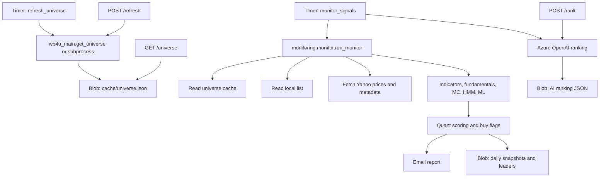
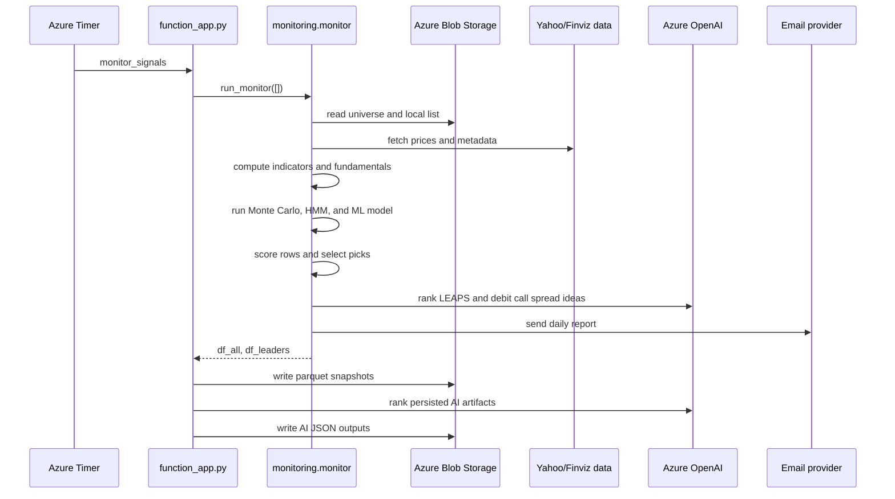

# Stocks Function App Architecture

## Purpose

`stocks-func-app` is an Azure Functions Python app that builds a stock universe,
runs a daily quantitative monitor, sends a daily stock-picks email, persists
daily artifacts to Azure Blob Storage, and optionally ranks tickers with Azure
OpenAI.

The app is designed for scheduled batch execution with a few HTTP endpoints for
health checks, universe reads, manual universe refreshes, and ad hoc AI ranking.

## Runtime

- Platform: Azure Functions, Python v2 programming model
- Entry point: `function_app.py`
- Function host config: `host.json`
- Dependencies: `requirements.txt`
- Durable data: Azure Blob Storage
- Market data: Yahoo Finance / YahooQuery / Finviz-based utilities
- AI ranking: Azure OpenAI through `ai_utils.py`

## Main Components



## Function Triggers

### `monitor_signals`

Scheduled by:

```text
0 30 23 * * 1-5
```

Runs on weekdays at 23:30 UTC. It:

1. Calls `daily_monitor.run_monitor`, which delegates to `monitoring.monitor.run_monitor`.
2. Fetches prices for the merged universe and local list.
3. Computes indicators, fundamentals, Monte Carlo probability, HMM regime
   probability, and ML probability.
4. Scores tickers and creates buy flags.
5. Sends the email report.
6. Writes daily parquet outputs to the `SIGNALS_CONTAINER` blob container.
7. Generates and persists Azure OpenAI ranking outputs.

### `refresh_universe`

Scheduled by:

```text
0 9 * * 1-5
```

Runs on weekdays at 09:00 UTC and also has `run_on_startup=True`.

It computes the stock universe using `WB4U_ENTRY`, defaulting to `wb4u_main.py`,
then stores the result in Blob Storage as `UNIVERSE_BLOB_NAME`, defaulting to
`universe.json`.

### `GET /health`

Anonymous health check. Returns:

```json
{"ok": true}
```

### `GET /universe`

Reads the cached universe from Blob Storage. If the cache is missing, it computes
and writes a new universe once. The response includes a `stale` flag based on
`UNIVERSE_TTL_MIN`.

### `POST /refresh`

Manually refreshes the universe. This route requires `REFRESH_SHARED_KEY` to be
set and supplied through either:

```text
x-refresh-key: <key>
```

or:

```text
?key=<key>
```

### `POST /rank`

Ranks supplied tickers with Azure OpenAI.

If `RANK_SHARED_KEY` is set, callers must provide either:

```text
x-rank-key: <key>
```

or:

```text
?key=<key>
```

Example request body:

```json
{
  "tickers": ["MSFT", "NVDA", "AAPL"],
  "strategy": "leaps",
  "horizon": "12-24 months"
}
```

## Daily Monitor Flow



## Quant, Monte Carlo, HMM, and ML Design

### Feature Engineering

`monitoring.monitor.run_monitor` fetches roughly 420 calendar days of price
history. Per ticker it computes:

- Trend and flow: ADX, MFI, RSI, MACD histogram
- Returns: 1 day, 5 day, 20 day, 21 day, 60 day, 63 day, 120 day, 252 day
- Moving averages: 20 day, 50 day, 200 day
- Volatility: 20 day and 60 day realized volatility
- Breakout distance: distance from 52 week high
- Fundamentals: quarterly revenue and earnings trends
- Liquidity and market-cap related fields

### Monte Carlo

`monitoring.simulations.mc_paths_prob_up` estimates the probability that a stock
finishes above the current price over 30 and 40 trading days. It uses daily drift
and volatility from recent returns and a geometric Brownian motion closed form.

Invalid inputs return `NaN`. Near-zero volatility is handled deterministically so
flat series do not create artificial failures.

### HMM Regime

`monitoring.simulations.fit_hmm_regime` fits a two-state Gaussian HMM on cleaned
daily returns. The state with the higher mean return is treated as the bull
state. If hmmlearn is unavailable, there is too little history, returns are flat,
or fitting fails, the function returns a neutral probability of `0.50`.

### ML Direction Model

`monitoring.model_predict.train_direction_model` trains a logistic-regression
classifier across all enriched ticker frames. The target is whether the forward
30 trading day return is non-negative.

If there is insufficient data or only one target class, the model falls back to a
dummy prior model. `predict_up_probability_for_latest` then produces the latest
available probability for each ticker.

## Blob Storage Layout

Container names are configurable through environment variables.

Default universe cache:

```text
cache/universe.json
```

Default signals output:

```text
signals/daily_snapshot_<yyyy-mm-dd>.snappy.parquet
signals/leaders_<yyyy-mm-dd>.snappy.parquet
signals/ai_leaps_<yyyy-mm-dd>.json
signals/ai_debit_call_spreads_<yyyy-mm-dd>.json
signals/local_list.json
```

## Required App Settings

Set these in the Azure Function App configuration:

```text
FUNCTIONS_WORKER_RUNTIME=python
AzureWebJobsStorage=<storage connection string for the function host>
MONITOR_STORAGE=<storage connection string for universe/signals data>
```

Recommended:

```text
REFRESH_SHARED_KEY=<shared secret for POST /refresh>
RANK_SHARED_KEY=<shared secret for POST /rank>
UNIVERSE_CONTAINER=cache
UNIVERSE_BLOB_NAME=universe.json
SIGNALS_CONTAINER=signals
MIN_DOLLAR_VOL=1000000
PENNY_PRICE=5
AI_TOPK=10
QUIET_HTTP_LOGS=1
```

Required for Azure OpenAI ranking:

```text
AZURE_OPENAI_ENDPOINT=<endpoint>
AZURE_OPENAI_API_KEY=<key>
AZURE_OPENAI_DEPLOYMENT=<deployment name>
AZURE_OPENAI_API_VERSION=2024-10-21
```

Email settings are consumed by `monitoring.emailer`; keep those app settings in
Azure as well.

## Azure Update Procedure

Run commands from:

```powershell
cd "c:\pers\krishnaposa-mlo-site\azure\functions\stocks-func-app"
```

### 1. Confirm Azure CLI and Functions Core Tools

```powershell
az --version
func --version
```

If needed, sign in:

```powershell
az login
az account set --subscription "<subscription-id-or-name>"
```

### 2. Validate Locally

Create or activate a Python virtual environment, install dependencies, and run a
syntax check:

```powershell
python -m venv .venv
.\.venv\Scripts\Activate.ps1
python -m pip install --upgrade pip
python -m pip install -r requirements.txt
python -m py_compile function_app.py universe_utils.py monitoring\monitor.py monitoring\simulations.py monitoring\model_predict.py
```

Optional local function host:

```powershell
func start
```

For local Blob emulation, `local.settings.json` currently uses:

```json
{
  "AzureWebJobsStorage": "UseDevelopmentStorage=true"
}
```

Set `MONITOR_STORAGE` locally before testing storage-backed flows.

### 3. Update App Settings in Azure

Replace placeholders with your actual resource group and function app name:

```powershell
$resourceGroup = "<resource-group>"
$functionApp = "<function-app-name>"
```

Set or update runtime and storage settings:

```powershell
az functionapp config appsettings set `
  --resource-group $resourceGroup `
  --name $functionApp `
  --settings `
    FUNCTIONS_WORKER_RUNTIME=python `
    MONITOR_STORAGE="<storage-connection-string>" `
    REFRESH_SHARED_KEY="<refresh-key>" `
    RANK_SHARED_KEY="<rank-key>" `
    UNIVERSE_CONTAINER=cache `
    UNIVERSE_BLOB_NAME=universe.json `
    SIGNALS_CONTAINER=signals `
    MIN_DOLLAR_VOL=1000000 `
    PENNY_PRICE=5 `
    AI_TOPK=10 `
    QUIET_HTTP_LOGS=1
```

Set Azure OpenAI settings:

```powershell
az functionapp config appsettings set `
  --resource-group $resourceGroup `
  --name $functionApp `
  --settings `
    AZURE_OPENAI_ENDPOINT="<azure-openai-endpoint>" `
    AZURE_OPENAI_API_KEY="<azure-openai-key>" `
    AZURE_OPENAI_DEPLOYMENT="<deployment-name>" `
    AZURE_OPENAI_API_VERSION="2024-10-21"
```

Use Azure Key Vault references for secrets when possible.

### 4. Deploy Code

From the function app folder:

```powershell
func azure functionapp publish $functionApp
```

If deployment should build remotely:

```powershell
func azure functionapp publish $functionApp --build remote
```

### 5. Restart and Verify

```powershell
az functionapp restart --resource-group $resourceGroup --name $functionApp
```

Get the app host name:

```powershell
$hostName = az functionapp show `
  --resource-group $resourceGroup `
  --name $functionApp `
  --query defaultHostName `
  --output tsv
```

Check health:

```powershell
Invoke-RestMethod "https://$hostName/api/health"
```

Check universe:

```powershell
Invoke-RestMethod "https://$hostName/api/universe"
```

Manually refresh the universe:

```powershell
Invoke-RestMethod `
  -Method Post `
  -Uri "https://$hostName/api/refresh" `
  -Headers @{ "x-refresh-key" = "<refresh-key>" }
```

Test ranking:

```powershell
Invoke-RestMethod `
  -Method Post `
  -Uri "https://$hostName/api/rank" `
  -Headers @{ "x-rank-key" = "<rank-key>" } `
  -ContentType "application/json" `
  -Body '{"tickers":["MSFT","NVDA","AAPL"],"strategy":"leaps","horizon":"12-24 months"}'
```

### 6. Monitor Logs

Stream logs:

```powershell
az functionapp log tail --resource-group $resourceGroup --name $functionApp
```

Check Application Insights for timer execution failures, dependency failures,
OpenAI errors, storage errors, and timeout behavior.

## Operational Notes

- `refresh_universe` has `run_on_startup=True`, so deployment or restart may
  trigger an immediate universe rebuild.
- `POST /rank` can call Azure OpenAI and incur cost. Keep `RANK_SHARED_KEY` set.
- `MONITOR_STORAGE` is required for universe and signal storage.
- Large universes increase Yahoo fetch time, HMM/ML compute time, and OpenAI
  prompt size.
- The scheduled monitor sends email from inside `run_monitor`; deploy changes
  carefully if email configuration is live.

## Common Troubleshooting

### `MONITOR_STORAGE is not set`

Set `MONITOR_STORAGE` in Azure app settings and restart the app.

### `/refresh` returns `Forbidden`

Confirm `REFRESH_SHARED_KEY` in Azure and pass the same value as `x-refresh-key`
or `?key=...`.

### `/rank` returns `Forbidden`

Confirm `RANK_SHARED_KEY` in Azure and pass the same value as `x-rank-key` or
`?key=...`.

### AI ranking returns an error

Check `AZURE_OPENAI_ENDPOINT`, `AZURE_OPENAI_API_KEY`,
`AZURE_OPENAI_DEPLOYMENT`, and `AZURE_OPENAI_API_VERSION`.

### Timer does not run

Check that the Function App is not stopped, the storage account is reachable,
and the timer trigger appears in the Azure Portal Functions list.

