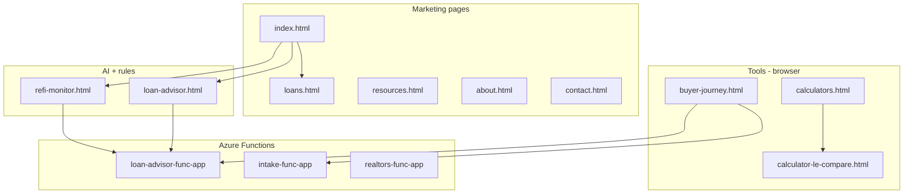

# Krish Posa MLO Site — Mortgage & Loan Services Inventory

**Site:** [krishnaposa-mlo-site](https://www.krishposa.com)  
**MLO:** Krish Posa · NMLS #2533287 · Georgia focus  
**Last reviewed:** May 2026

This document inventories all mortgage-related pages, tools, backends, and known gaps on the static MLO marketing site.

---

## Architecture overview

The site is a **static marketing site** with:

- Program and resource content (HTML)
- **Client-side calculators** (no server required)
- **Azure Functions** for AI loan advisor, refi monitor, pre-approval intake, and realtor partner forms
- **External LOS** for real applications: [https://krishposa.com/](https://krishposa.com/)



### Typical borrower flow

1. **Discover** — `index.html` / `loans.html` / blog
2. **Explore** — `calculators.html` or Loan Advisor
3. **Refinance** — `refi-monitor.html` (existing loan)
4. **Compare offers** — `calculator-le-compare.html`
5. **Apply** — `buyer-journey.html` intake or external Apply Now → `krishposa.com`
6. **Human touch** — WhatsApp, calendar, email (`contact.html`)

---

## Navigation

**Primary nav** (`partials/header.html`):

| Nav label | Target |
|-----------|--------|
| Home | `index.html` |
| Loan Programs | `loans.html` |
| Resources | `resources.html` |
| Loan Advisor (AI) | `loan-advisor.html` |
| Refi Monitor | `refi-monitor.html` |
| About | `about.html` |
| Tools | `calculators.html` |
| Blog | `blogs/blog.html` |
| Apply Now | External `https://krishposa.com/` |

**Footer** (`partials/footer.html`): Home, Loans, Resources, AI Loan Advisor, Refi Monitor, About, Blog — no Tools/Calculators or Buyer Journey.

---

## 1. Marketing & content pages

| Path | Purpose |
|------|---------|
| `index.html` | Main landing: hero, FAQs, CTAs to AI advisor, buyer journey, LE compare |
| `loans.html` | Programs: Conventional, FHA, VA, Jumbo, Refinance, Second Opinion |
| `resources.html` | Checklists, refi tips, LE-by-email, booking |
| `about.html` | MLO bio, credentials |
| `contact.html` | Apply (external), WhatsApp, calendar, contact |
| `privacy.html` | Privacy policy (linked from Loan Advisor) |

### Realtor co-brand landings

| Path | Purpose |
|------|---------|
| `realtors/sereneGA.html` | Co-branded Krish + Serene Georgia Realty |
| `realtors/gvr.html` | Co-branded Krish + GVR Realty LLC |
| `index-realtor.html` | Redirect to Serene GA landing |
| `realtors/partner-with-us.html` | Realtor partnership application → Azure |
| `realtors/index.html`, `index-gvr.html` | Additional realtor index variants |

### Blog (mortgage-related)

| Path | Topic |
|------|-------|
| `blogs/blog-ai-loan-advisor.html` | AI Loan Advisor launch |
| `blogs/blog-mortgage-rates.html` | Atlanta rates / refi math |
| `blogs/blog-tools.html` | Buyer funnel, calculators, AI advisor tour |
| `blogs/blog.html` | Blog index (`blog-posts.js`) |

---

## 2. Calculators & comparison (client-side)

**Core modules:** `assets/js/mortgage-calc.js`, `assets/js/calculators.js`, `assets/js/le-compare.js`

| Tool | Page | What it does |
|------|------|----------------|
| Affordability | `calculators.html` | Income, debts, down payment → max price |
| Monthly payment | `calculators.html` | P&I, taxes, insurance, PMI |
| Refi break-even | `calculators.html` | Simple months to recover closing costs |
| Extra payment | `calculators.html` | Time/interest saved with extra principal |
| Loan Estimate compare | `calculator-le-compare.html` | Two LEs: P&I, cash to close, 5-year cost, points break-even |

**Loan programs in payment calculator:** Conventional, FHA, VA, USDA, Jumbo, ARM (5/1, 7/1, 10/1).

**Georgia-specific:** County/ZIP tax estimates in `mortgage-calc.js`.

**Not present:** HELOC calculator or product page.

---

## 3. AI Loan Advisor

| Piece | Detail |
|-------|--------|
| Page | `loan-advisor.html` |
| Frontend | `assets/js/loan-advisor.js` |
| API config | `assets/js/loan-api-config.js` |
| Endpoint | `POST {LoanApi.base}/loanAdvisor` |

**Azure app:** `loan-advisor-func-app` (Flex Consumption, Node 22, East US 2)  
**Base URL:** `https://loan-advisor-func-app-b4etgvgde3eycsb5.eastus2-01.azurewebsites.net/api`

**Inputs:** Purchase/refi/cash-out, property type, FICO, DTI, ARM terms, VA eligibility, goals, etc.

**Outputs:** Product suggestion, estimated rate band, AI explanation (Azure OpenAI).

**Rates:** Rule-based baselines in `rate-pricing.js` (30/20/15 fixed, ARMs) with FICO/LTV/occupancy adjustments — **educational estimates, not live market feeds**.

**Source:** `azure/functions/loan-advisor-fn/loanAdvisor/`

---

## 4. Refi Monitor

| Piece | Detail |
|-------|--------|
| Page | `refi-monitor.html` |
| Frontend | `assets/js/refi-monitor.js`, `assets/js/refi-eval.js` |
| Endpoints | `POST …/refiCheck`, `POST …/refiWatch` |
| Cron | `refiCron` — Mon/Thu 14:00 UTC, re-checks watch list, emails on GO verdict |

**Features:**

- Current vs estimated market rate
- Break-even, monthly savings, LTV-style metrics
- Verdicts: GO / MAYBE / NOT_YET / NO_BENEFIT
- Optional email alerts (Azure Table Storage watch list)
- Local profile save in `localStorage`

**Shared logic:** `azure/functions/loan-advisor-fn/shared/refi-eval.js`, `rate-pricing.js`, `refi-watch-store.js`

**Deprecated:** Cloudflare worker at `cloudflare/loan-advisor-worker/` — migrated to Azure (`DEPRECATED.txt`).

---

## 5. Buyer journey & pre-approval intake

| Page | Script | Intake backend | Status |
|------|--------|----------------|--------|
| `buyer-journey.html` | `buyer-funnel-azure.js` | Azure `intakeSubmit` | **Working** |
| `buyer-funnel.html` | `buyer-funnel.js` | Google Form | Legacy fallback |
| `buyer-funnel-azure.html` | `buyer-funnel.js` (wrong) | Intended Azure | **Broken wiring** |

**Buyer journey includes:** Quick qualify, payment estimate, DTI, Azure intake form, document checklist, realtor co-brand block, links to calculators and loan advisor.

**Intake API:**

- App: `intake-func-app-d3cbf4achrcxdndt`
- URL: `https://intake-func-app-d3cbf4achrcxdndt.eastus2-01.azurewebsites.net/api/intakeSubmit`
- Source: `azure/functions/intakeSubmit/`
- Storage: Azure Table `intakeResponses`; email via ACS

---

## 6. Realtor partner channel

| Piece | Detail |
|-------|--------|
| Page | `realtors/partner-with-us.html` |
| Script | `assets/js/realtor-submit.js` |
| Co-brand | `assets/js/cobrand.js`, `cobrand-sereneGA.js` |

**API:**

- App: `realtors-func-app-gbdufbcvazeug7ew`
- URL: `https://realtors-func-app-gbdufbcvazeug7ew.eastus2-01.azurewebsites.net/api/realtorSubmit`
- Source: `azure/functions/realtors/`
- Storage: Cosmos DB + ACS email

**Known bug:** `realtor-submit.js` uses URL `…gbdufbcvazegue7ew…` (typo) vs buyer-funnel scripts `…gbdufbcvazeug7ew…` — partner form may fail until fixed.

---

## 7. Azure mortgage backends (summary)

| Function app | Endpoints | Purpose |
|--------------|-----------|---------|
| **loan-advisor-func-app** | `/loanAdvisor`, `/refiCheck`, `/refiWatch`, timer `refiCron` | AI advisor, refi eval, email watches |
| **intake-func-app** | `/intakeSubmit` | Pre-approval intake |
| **realtors-func-app** | `/realtorSubmit` | Realtor partner leads |

**Deploy / config:** `azure/functions/loan-advisor-fn/instructions.txt`  
**Local dev template:** `azure/functions/loan-advisor-fn/local.settings.example.json`

### Frontend API config

```javascript
// assets/js/loan-api-config.js
window.LoanApi = {
  base: 'https://loan-advisor-func-app-b4etgvgde3eycsb5.eastus2-01.azurewebsites.net/api'
};
```

---

## 8. JavaScript module reference

| File | Role |
|------|------|
| `mortgage-calc.js` | Shared P&I, taxes (GA), PMI, FHA/VA/USDA/jumbo/ARM, DTI |
| `calculators.js` | Wires `calculators.html` forms |
| `le-compare.js` | Loan Estimate side-by-side comparison |
| `refi-eval.js` | Browser refi math (mirrors Azure `shared/refi-eval.js`) |
| `loan-advisor.js` | Loan Advisor form → `/loanAdvisor` |
| `refi-monitor.js` | Refi Monitor → `/refiCheck`, `/refiWatch` |
| `buyer-funnel.js` | Payment estimate; Google Form intake |
| `buyer-funnel-azure.js` | Payment estimate; Azure intake |
| `realtor-submit.js` | Partner form → `/realtorSubmit` |
| `loan-api-config.js` | Azure loan-advisor base URL |

---

## 9. CSS & partials (mortgage UI)

| Path | Role |
|------|------|
| `assets/css/form-contrast.css` | Form styling on funnel/calculator pages |
| `assets/css/buyer-journey.css` | Buyer journey layout |
| `assets/css/le-compare.css` | LE comparison tables |
| `assets/css/cobrand.css`, `realtor.css` | Realtor co-brand pages |
| `partials/header.html`, `footer.html` | Shared nav/footer |

---

## 10. External services (not in repo)

| Service | Use |
|---------|-----|
| `https://krishposa.com/` | Primary Apply / Get Pre-Approved (LOS) |
| Google Form | Fallback pre-approval (`buyer-funnel.html`) |
| `https://calendar.app.google/22s8fcMQLge9g63d6` | Booking |
| GTM `GTM-KJZPQKBM` | Analytics |

---

## 11. Adjacent products (non-primary mortgage)

| Area | Pages | Backend |
|------|-------|---------|
| Rental / DSCR | `rentals/analyzer.html`, `rentals/compare.html` | `rent-analyzer-fn` |
| Stocks / investing | Invest pages, stocks pipeline | `stocks-func-app` (separate) |
| Karaoke | `karaoke/*` | `karaoke-func` — unrelated to mortgage |

---

## 12. User-facing features by category

### Calculators & comparison
- Affordability, monthly payment (multi-program), refi break-even, extra payment, LE compare

### AI Loan Advisor
- Scenario form → product + rate range + AI reasoning

### Refi Monitor
- Rate comparison, break-even, verdicts, email alerts

### Buyer journey / intake
- Qualify → estimate → Azure intake (on `buyer-journey.html`)

### Loan programs & content
- Static programs, resources, blogs, co-branded realtor landings

### Rates & amortization
- Static baselines + adjustments; amortization in LE compare and calculators

### Not offered
- HELOC (no pages or calculators)
- Dedicated ARM product page (ARM only in calculators + loan advisor)

---

## 13. Known gaps & risks

| Priority | Issue | Detail |
|----------|-------|--------|
| High | `buyer-funnel-azure.html` script mismatch | Loads `buyer-funnel.js` instead of `buyer-funnel-azure.js`; Formspree placeholder; duplicate of buyer-journey |
| High | Realtor API URL typo | `realtor-submit.js` has `…vazegue7ew…` vs correct `…vazeug7ew…` |
| Medium | Two intake paths | Google Form vs Azure — consolidate on `buyer-journey.html` |
| Medium | Refi Monitor not in sitemap | In nav but missing from `sitemap.xml` |
| Medium | Refi email alerts | Need `AzureWebJobsStorage` + ACS env vars on function app |
| Low | Nav/sitemap gaps | Buyer Journey not in header; Calculators not in footer |
| Low | Deprecated Cloudflare worker | Folder retained; remove from Cloudflare when ready |
| Low | Static rate baselines | Educational only — ensure disclaimers stay visible |
| Low | `buyer-funnel-azure.html` typo | "Oppurtunity" in calculator card text |

---

## 14. Related documentation in repo

| Path | Content |
|------|---------|
| `azure/functions/loan-advisor-fn/instructions.txt` | Deploy guide, app settings, curl tests |
| `cloudflare/loan-advisor-worker/DEPRECATED.txt` | Migration notice to Azure |
| `sitemap.xml` | SEO URLs (some tools missing) |
| `azure/functions/rent-analyzer-fn/instructions.txt` | Rental analyzer (adjacent) |

---

## 15. Quick reference — curl smoke tests

```bash
# Loan Advisor (replace body with valid JSON)
curl -X POST "https://loan-advisor-func-app-b4etgvgde3eycsb5.eastus2-01.azurewebsites.net/api/loanAdvisor" \
  -H "Content-Type: application/json" \
  -d '{"loanPurpose":"purchase","propertyType":"primary","creditScore":740}'

# Refi check
curl -X POST "https://loan-advisor-func-app-b4etgvgde3eycsb5.eastus2-01.azurewebsites.net/api/refiCheck" \
  -H "Content-Type: application/json" \
  -d '{"currentRate":7.25,"loanBalance":320000,"propertyValue":450000}'
```

See `azure/functions/loan-advisor-fn/instructions.txt` for full examples and required app settings.

---

## Summary

The site delivers a **strong mortgage toolkit**: client-side calculators, AI loan advisor, refi monitor with optional email alerts, LE comparison, and Azure lead capture for intake and realtor partners. Main weaknesses are **wiring inconsistencies** (buyer-funnel-azure page, realtor URL typo) and **duplicate funnel pages**, not missing core mortgage features.

**Recommended canonical paths for borrowers:**

| Goal | Use this page |
|------|----------------|
| Explore payment / affordability | `calculators.html` |
| AI product fit | `loan-advisor.html` |
| Refinance decision | `refi-monitor.html` |
| Compare two LEs | `calculator-le-compare.html` |
| Start pre-approval intake | `buyer-journey.html` |
| Full application | External `krishposa.com` |
