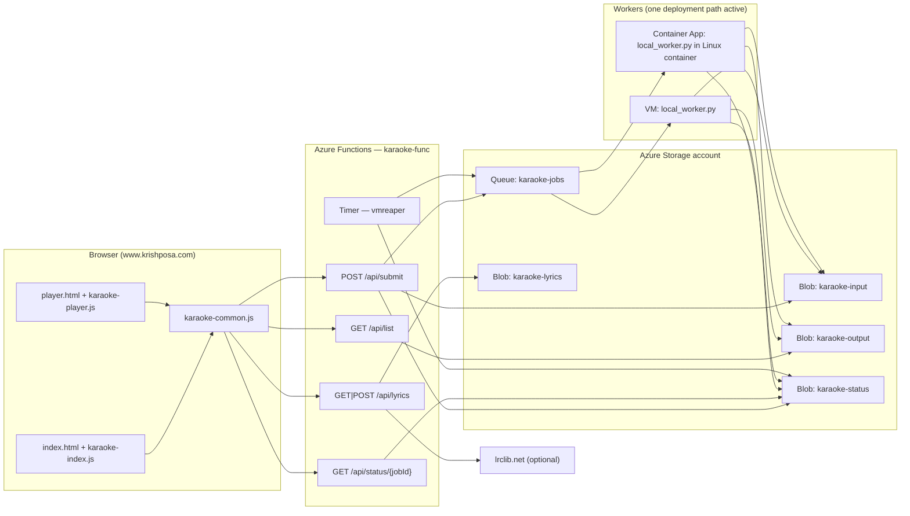
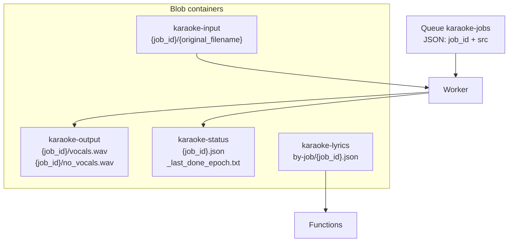
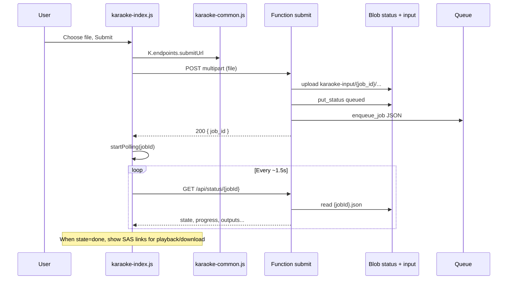
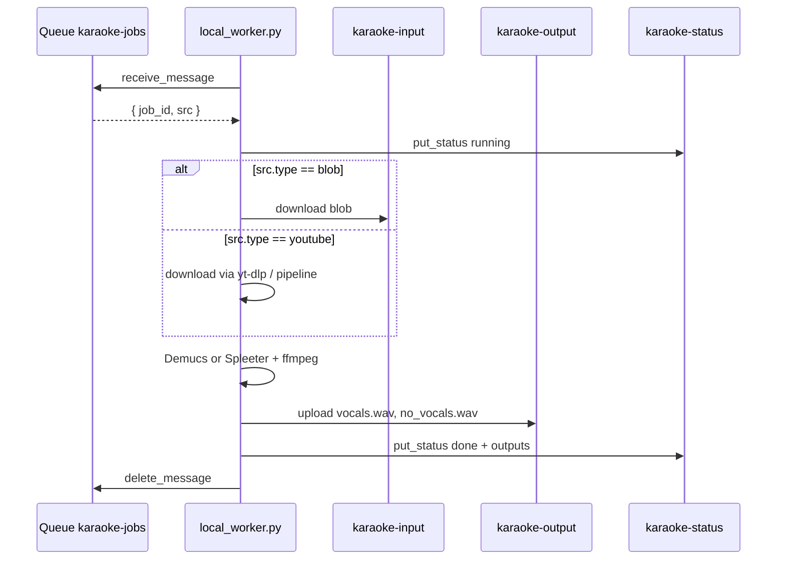
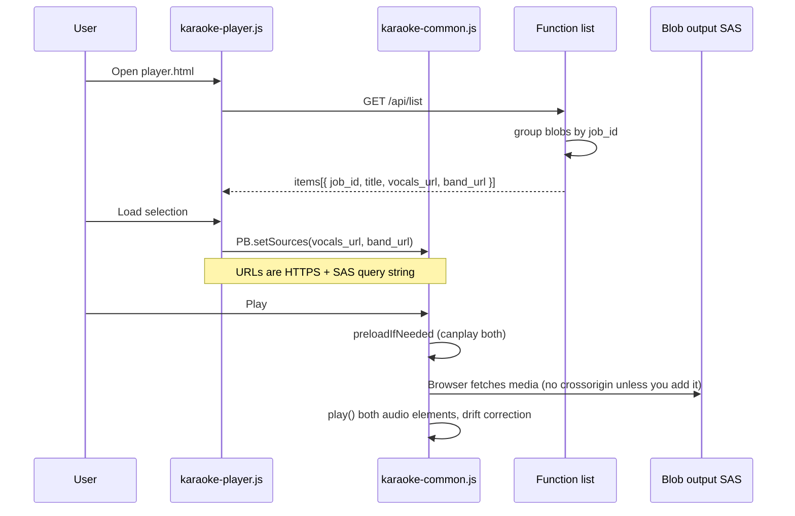
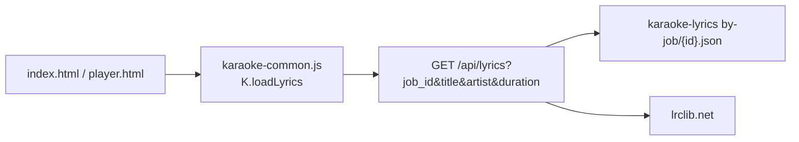
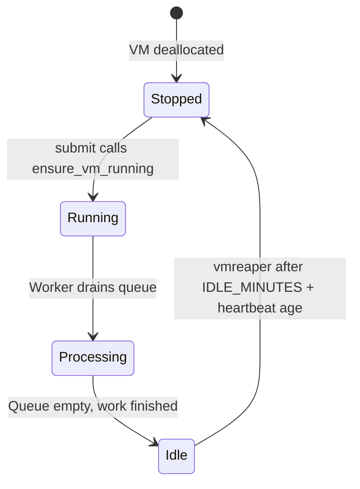

# Karaoke feature — architecture and design

This document describes how the karaoke split pipeline fits together: static site pages (HTML/CSS/JS), Azure Functions (HTTP API), Azure Storage (blobs + queue + optional lyrics), and workers that drain the job queue (VM agent or Container Apps).

---

## 1. Goals (product intent)

The **main purpose** is live karaoke practice and performance: the singer routes **vocals** (the separated reference vocal) to **Bluetooth** in-ear and the **band** (instrumental / no-vocals stem) to **room speakers**, so they hear pitch and timing clearly without fighting the PA mix, while the room hears only the backing track.

Supporting goals:

- **Upload** an audio file (or submit a YouTube URL via the same API shape) and receive a **job id**.
- **Process** offline: separate **vocals** vs **band** (accompaniment / no_vocals) with Demucs or Spleeter, then upload WAVs to blob storage.
- **Track** job state in JSON blobs for the uploader UI to poll.
- **Play** completed jobs in the browser: dual `<audio>` elements with per-device routing (`setSinkId` where supported), optional LRC-style lyrics, and a **list** endpoint that returns time-limited **SAS URLs** for output files.

---

## 2. High-level system

---

## 3. Repository map (HTML, JavaScript, Azure)

### 3.1 Static site — pages and scripts

| Asset | Role |
|--------|------|
| `karaoke/index.html` | Uploader UI, progress, links when done, lyrics section; loads `karaoke-common.js` then `karaoke-index.js`. |
| `karaoke/player.html` | Picker for finished jobs, dual-audio playback, sync/offset; optional `meta[name="karaoke-list"]` to override list URL; loads `karaoke-common.js` then `karaoke-player.js`. |
| `assets/js/karaoke-common.js` | **`KARAOKE` namespace**: `API_BASE`, `K.endpoints` (`submit`, `status`, `lyrics`, `list`), `initPlaybackControls()`, `loadLyrics()`, LRC parser, playback callbacks. |
| `assets/js/karaoke-index.js` | Submit `FormData` to `/api/submit`, poll `/api/status/{id}`, render SAS links, wire lyrics buttons, `initPlaybackControls()`. |
| `assets/js/karaoke-player.js` | `fetch` `/api/list`, populate `<select>`, **Load selection** → `PB.setSources(vocals_url, band_url)`, lyrics + sync wiring. |
| `assets/css/karaoke.css`, `assets/css/dark-surface.css` | Layout and theme for karaoke pages. |

Scripts are referenced from production with absolute URLs under `https://www.krishposa.com/assets/...` (see each HTML file).

### 3.2 Azure Functions app (`azure/functions/karaoke-func/`)

| Function folder | Trigger | Implementation | Purpose |
|------------------|---------|----------------|---------|
| `submit/` | HTTP `POST` / `OPTIONS` | `submit/init.py` | Validate **file XOR youtube_url**; write input blob or record YouTube source; `put_status(queued)`; `enqueue_job`; optionally `ensure_vm_running()`. |
| `status/` | HTTP `GET` | `status/init.py` | Return JSON job status from `karaoke-status` container (`{job_id}.json`). |
| `list/` | HTTP `GET` / `OPTIONS` | `list/init.py` | Scan `karaoke-output` for pairs `vocals.wav` + `no_vocals.wav` (or `accompaniment.wav`); return `items[]` with SAS URLs. |
| `lyrics/` | HTTP `GET` / `POST` / `OPTIONS` | `lyrics/init.py` | Load/save per-job lyrics in `karaoke-lyrics`; GET may call **lrclib.net** for search/synced LRC. |
| `vmreaper/` | Timer | `vmreaper/init.py` | If queue empty and worker idle beyond `IDLE_MINUTES`, **deallocate** the processing VM (when `WORKER_VM_ENABLED`). |

Shared library: `shared.py` — storage clients, `enqueue_job`, `put_status` / `get_status`, queue depth, VM start/deallocate helpers.

Infrastructure as code: `azure/functions/karaoke-func/infra/*.bicep` (+ compiled JSON) and `infra/deploy.ps1` for deployment automation.

### 3.3 Workers

| Path | Role |
|------|------|
| `azure/virtualmachine/karaoke-agent/local_worker.py` | Long-running process: **receive** messages from `karaoke-jobs`, download source (blob or YouTube flow per message), run **ffmpeg / Demucs / Spleeter**, upload `job_id/vocals.wav` and `job_id/no_vocals.wav`, update status JSON and heartbeat blob for vmreaper. |
| `azure/virtualmachine/karaoke-agent/requirements.txt` | Python dependencies for the worker. |
| `azure/container-apps/karaoke-worker/Dockerfile` | Linux image: ffmpeg + `local_worker.py` as **CMD** (same script, different hosting model than the VM). |
| `azure/container-apps/infra/main.aca-worker.bicep` (+ `.json`) | Container Apps, registry, scaling, env — optional alternative to the VM worker. |

---

## 4. Storage layout (conceptual)

Environment variables (typical): `STORAGE_CONN`, `INPUT_CONTAINER`, `OUTPUT_CONTAINER`, `STATUS_CONTAINER`, `QUEUE_NAME`, `LYRICS_CONTAINER`, VM identifiers for `ensure_vm_running` / `deallocate_vm`, `WORKER_VM_ENABLED`, etc. See `shared.py`, `local.settings.json`, and Bicep parameter files for the authoritative set.

---

## 5. Sequence: submit and poll (index page)

---

## 6. Sequence: worker consumes queue

---

## 7. Sequence: list and play (player page)

**Design note:** Output playback uses **time-limited SAS URLs** minted by the Function (account key in `list/init.py`). The `<audio>` elements should not use `crossorigin="anonymous"` unless blob **CORS** on the storage account allows your site origin; otherwise decoding can fail.

---

## 8. Lyrics flow

`lyrics/init.py` supports **POST** to persist edited text/LRC per job. The index page calls `K.saveLyrics(...)`; ensure that helper exists on `KARAOKE` and POSTs to the same `/api/lyrics` endpoint if you rely on Save in production.

---

## 9. VM lifecycle (optional cost control)

When `WORKER_VM_ENABLED` is false (e.g. laptop worker), Functions skip start/deallocate; the same queue is consumed by **local_worker** wherever it runs.

---

## 10. Cross-cutting concerns

| Topic | Where handled |
|--------|----------------|
| **CORS** | Functions add `Access-Control-Allow-Origin` (often `*`) on HTTP responses; browser `fetch(..., { mode: 'cors' })` from the site. |
| **Auth to Functions** | Optional `?code=` via `FUNCTION_CODE` in `karaoke-common.js`. |
| **Secrets** | `STORAGE_CONN`, subscription/RG/VM name in Function App settings; not committed to git in real deployments. |
| **Idempotency / retries** | Worker uses visibility timeout and status updates; failed jobs should be visible in status JSON (see worker error paths). |

---

## 11. Related operational docs

- `karaoke/instructions.txt` — deploy steps, Container Apps path, environment hints.
- `azure/functions/karaoke-func/infra/deploy.ps1` — Function App + optional storage deployment.

---

## Document history

- Created to align HTML, JavaScript, and Azure components with end-to-end flow diagrams for onboarding and reviews.
